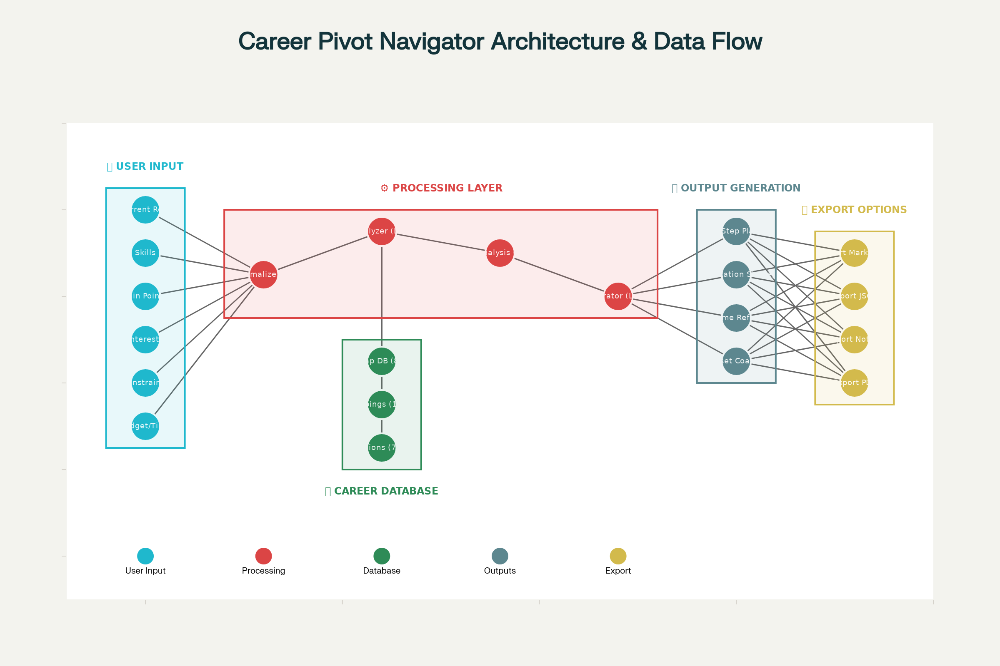

# Career Pivot Navigator

**An AI-assisted career exploration prototype for neurodivergent, marginalized, and burnt-out professionals who need concrete options, not motivational fog.**

Career Pivot Navigator combines a small, structured career dataset with an OpenAI language model to translate a person's skills, constraints, pain points, and interests into plausible pivot directions and a three-step exploration plan. It is designed as decision support, not an automated career authority.

[](https://www.python.org/downloads/)
[](https://python.langchain.com/)
[](https://platform.openai.com/docs/models)



## Problem

Most career tools flatten a complicated transition into job-title matching or generic encouragement. That is particularly weak for people balancing disability, burnout, limited money, caregiving, identity-based barriers, or the need to keep earning during a pivot.

The product question was: **How might a career tool turn messy lived constraints into a small set of inspectable options and realistic first moves?**

## Approach

The navigator uses two complementary layers:

1. **Deterministic matching** compares user-entered skills and pain points with eight curated career profiles.
2. **LLM synthesis** uses that structured context to explain fit, tradeoffs, and next steps in plain language.

Users can run the flow in a terminal or through a Streamlit interface. Plans can be exported as Markdown or JSON for later editing.

## Key Decisions

- **Constraints are first-class input.** Budget, time, remote preference, and other limits shape the plan instead of appearing as an afterthought.
- **The career map grounds the model.** Recommendations begin with a local JSON dataset rather than unconstrained title generation.
- **Three steps, deliberately.** The output favors a short exploration sequence over a sprawling reinvention plan.
- **Multiple interfaces share one core.** CLI and Streamlit support different access preferences without duplicating the analysis logic.
- **Human judgment stays in the loop.** The model proposes directions; the user evaluates them against current labor-market evidence and lived reality.

## Architecture

The application loads and normalizes user input, scores potential matches against the local career map, builds context for LangChain prompts, and sends that context to OpenAI. Results are then displayed in the CLI or Streamlit UI and can be exported.

```text
User input
   │
   ▼
Normalize skills, pain points, interests, and constraints
   │
   ├──► Local career map ──► deterministic match signals
   │
   ▼
LangChain prompt composition
   │
   ▼
OpenAI ChatOpenAI (default in code: gpt-4o)
   │
   ▼
Career rationale + three-step plan
   │
   ├──► CLI
   ├──► Streamlit
   └──► Markdown / JSON export
```

The diagram above is the existing project architecture asset, now surfaced where reviewers can actually see it instead of making them conduct archaeology.

## Validation

Current evidence is limited to implementation inspection and the repository's setup checker:

- The codebase contains shared analysis, plan-generation, prompt, and export modules.
- Both main LLM entry points default to `gpt-4o`.
- The local career map contains eight career profiles used for deterministic matching.
- `Core Logic/test_setup.py` checks the Python version, required packages, API-key configuration, expected files, and career-map availability.

A clean-environment install, end-to-end model run, structured usability study, and recommendation-quality evaluation are **not yet documented**. This README therefore describes the project as a prototype, not production-ready software.

## Limitations

- Recommendations are generated from user input, a small static career dataset, and an LLM. They can be incomplete, inaccurate, or overly confident.
- Salary ranges are illustrative fields in the local dataset, not live market data. Verify compensation, qualifications, and demand with current sources.
- Accessibility intent is present in the product framing, but the Streamlit interface has not been documented against WCAG or tested with assistive-technology users.
- User-provided career information is sent to the configured OpenAI API. Do not enter confidential employer, client, health, or identity information unless you have assessed that data flow.
- Output should support research and reflection. It should not replace professional, financial, legal, medical, or employment advice.
- The default model is specified in code. The optional `MODEL_NAME` example in `.env.example` is not currently read by the application.

## Status

**Prototype / portfolio proof-of-work.** The CLI and Streamlit paths are implemented; public deployment and formal product validation are not documented.

Current presentation pass: issue [#2](https://github.com/chanelle/career-pivot-navigator/issues/2).

Next milestone: verify installation and both interfaces in a clean environment, capture representative UI evidence, and document the results before making stronger readiness or accessibility claims.

## Quick Start

### Prerequisites

- Python 3.8+
- An [OpenAI API key](https://platform.openai.com/api-keys)

### Install

```bash
git clone https://github.com/chanelle/career-pivot-navigator.git
cd career-pivot-navigator
python -m venv .venv
source .venv/bin/activate
python -m pip install -r "Data and Infrastructure/requirements.txt"
cp .env.example .env
```

Add your API key to `.env`:

```text
OPENAI_API_KEY=your-key-here
```

### Run

CLI:

```bash
cd "Core Logic"
python main.py
```

Streamlit:

```bash
cd "Core Logic"
python main.py streamlit
```

Then open [http://localhost:8501](http://localhost:8501).

## What It Produces

Given a current role, skills, pain points, interests, budget, time, and constraints, the prototype can produce:

- one or two explained career-pivot directions;
- matched records from the local career map;
- a three-step exploration plan;
- transition-time monetization ideas;
- resume reframing and mindset prompts;
- Markdown or JSON exports.

The salary and timeline fields are planning prompts, not guarantees.

## Project Structure

```text
career-pivot-navigator/
├── Core Logic/
│   ├── main.py
│   ├── analyze.py
│   ├── plan_generator.py
│   ├── prompts.py
│   ├── test_setup.py
│   └── utils.py
├── Data and Infrastructure/
│   ├── career_map.json
│   └── requirements.txt
├── Documentation/
├── career_pivot_architecture.png
├── .env.example
└── README.md
```

## Technology

- Python
- LangChain and `langchain-openai`
- OpenAI Chat Completions through `ChatOpenAI`
- Streamlit
- Pydantic
- JSON and Markdown export

## AI Involvement and Human Decisions

AI is used at runtime to synthesize career rationales, plans, monetization ideas, resume reframes, and coaching language. The application's structure, prompt intent, career-map schema, constraint model, interaction modes, and decision to keep recommendations advisory are human product decisions.

Generated output is intentionally reviewable. A user remains responsible for checking claims, rejecting poor fits, researching current market conditions, and deciding what action, if any, to take.

## Documentation

- [Quick-start reference](QUICKSTART.md)
- [Launch guide](LAUNCH_GUIDE.md)
- [Development guide](Documentation/CODEX_GUIDE.md)
- [Technical project summary](Documentation/PROJECT_SUMMARY.md)

## Security

Keep `.env` out of version control and inspect `git status` before committing. Treat any career history entered into the tool as data transmitted to the configured model provider.

## License

[MIT](LICENSE.md)
